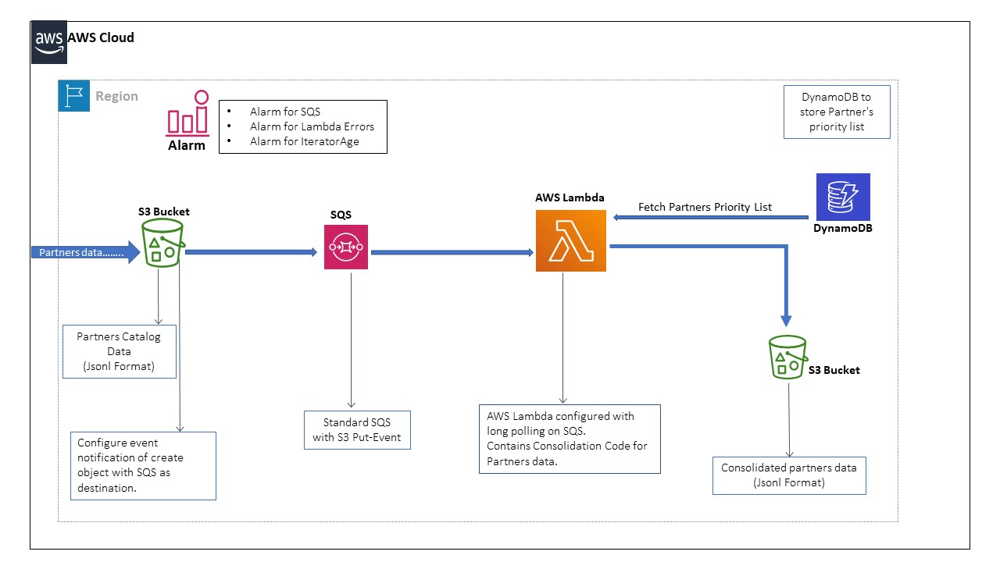

## Data Pipeline design for Accommodation Consolidator.

## Table of contents
* [General info](#general-info)
* [Technologies & AWS Services](#technologies)
* [Flow-Diagram](#flow-diagram)
* [AWS Resource Configuration](#aws resource configuration)
* [Deployment Pipeline](#deployment pipeline)

## General info
Accommodation Consolidator project is designed to process and consolidate the partners catalog data using multiple AWS resources. The
input raw data is going to be S3 bucket and after consolidation the output destination is also S3 bucket.
This documents take you through the complete data pipeline design i.e. reading from s3, processing components & final storage.

## Technologies & AWS Services
* Python3.X
* Terraform for IAC (Infrastructure as Code)
* Jenkins for Automation of Infra and Code Deployment
* AWS Resources:
    * S3 Bucket
    * SQS
    * AWS DynamoDB
    * AWS Lambda
    * AWS CloudWatch
    * AWS IAM
    
 
## Orchestrate & Deploy Pipeline
To implement the Continuous Integration we can use GitHub to manage our code and its revison. 
For Continuous Deployment of AWS Infra & Code I would prefer to go with Terraform to have IAC and Jenkins 
for deployment process.
* Create JenkinsFile to script the pipeline based on parameters such as environment, create/destroy.
* Script will have multiple stages for building the archive,  initialize the terraform, validating & executing the plan,
  and base on the user response Apply or Destroy the plan.
* Finally send the email notification to end user for success or failure of job.

Sample Jenkinsfile I have attached from one of my github repository.

## AWS Resource Configuration

Source S3 Bucket
***
> Source S3 bucket will receive partner's catalog data in the form of jsonl files.
> We can configure s3 event notification for all created/put object api calls with destination as SQS.
* S3 is one of the cost efficient and highly durable storage service and suits our requirement to store the file
for specific Year/Month/Day/File-*.jsonl
* Configure replication and encryption to have disaster recovery and unwanted access. 

SQS
***
> SQS will act as the interface between consolidator and the raw data received in S3 bucket.
> For each new record in s3 a SQS event will be pushed in SQS.
* SQS Access policy to allow S3 to publish events
* Standard SQS for unlimited throughput
* ReceiveMessageWaitTimeSeconds to reduce empty response from SQS 20s
* Configure DLQ to store all erroneous and throttled messages
* MaxReceiveCount of 10, so that throttled message will eventually get processed.
* VisibilityTimeout should be approx 450s as out lambda is configured with 90s

AWS DynamoDB
***
> AWS DynamoDB to store list of priority partners.
* Configure sufficient amount of ReadCapacity (5) along with 2 write capacity is sufficient.
* DynamoDB has been considered to store the Partner's Priority list as it has a easy integration
with AWS lambda and provide single digit of millisecond to fetch the data. Along with this it can 
be further used to store more information required such as black-listed partner's.
* Current design of DynamoDB table has high read capacity and very less write capacity. Partition key is String with 
header as ContentType. And partner's list is store in List datatype of dynamoDB. 

AWS Lambda
***
> AWS lambda to execute consolidator script.
* Triggered configured with SQS.
* Timeout of 
* Batch Size of 10 (Configurable to 10,000 as per latest updates)
* Batch Window of 120s so that lambda wait to poll messages from SQS
* Use tmp/ folder to store intermediate jsonl file before writing to S3
* AWS Lambda is one of the best option for event based processing and cost Pay as you use. We have option of 
concurrency to have sufficient amount of running lambda at any given time.

AWS CloudWatch
***
> AWS CloudWatch to store lambda logs, metric to track lambda error, IteratorAge & SQS
ApproximateAgeOfOldestMessage to identify how fast is queue being processed.
* AWS CloudWatch will be utilized to store lambda logs, configure SNS notifications for metrics threshold values 
configured for SQS, AWS Lambda.

AWS IAM
***
> AWS IAM role to have granular access to other services from AWS lambda.

## How the components will be triggered
* Each new object in the source S3 bucket will generate a event notification and publish it to SQS. SQS event record 
can contain more than one event of S3 object.
* Lambda trigger is integrated with SQS with batch size of 10 records and batch window of 120s. Lambda will continuously
poll records form SQS and performs consolidation of catalog data.
* After consolidation lambda will store the jsonl file in /tmp directory provide for each lambda instance having 512mb
capacity. This intermediate process will help us to control the size of output file within 500K.
* Finally, code will upload the files from /tmp folder to destination S3 bucket with proper path i.e:
'/year=2021/month=01/day=31/output_object-<MICROSECOND>.jsonl'

## Monitor Pipeline
* To monitor the data pipeline we can create a CloudWatch dashboard which show number of records/object received at
SQS and number of objects processed at lambda code. 

## Flow-Diagram

## Important Links
[Batch-Window feature for AWS lambda & SQS integration](https://aws.amazon.com/about-aws/whats-new/2020/11/aws-lambda-now-supports-batch-windows-of-up-to-5-minutes-for-functions/)